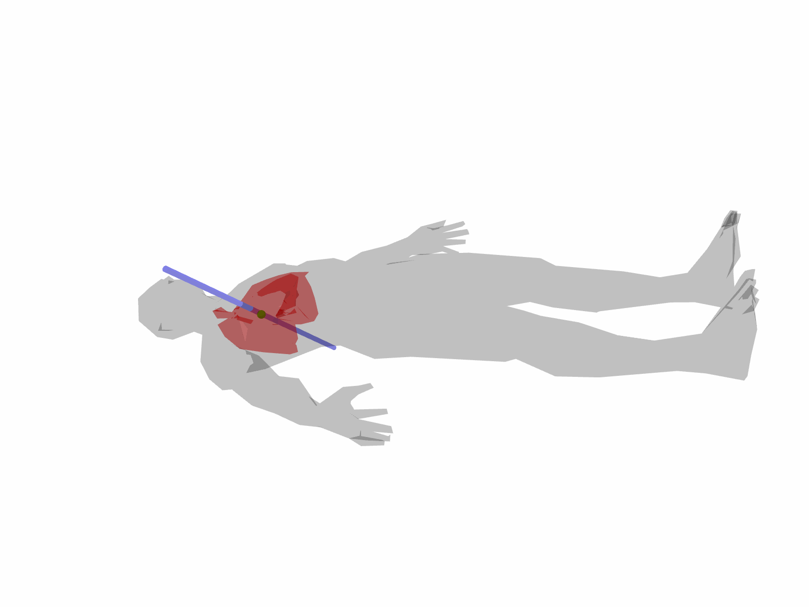
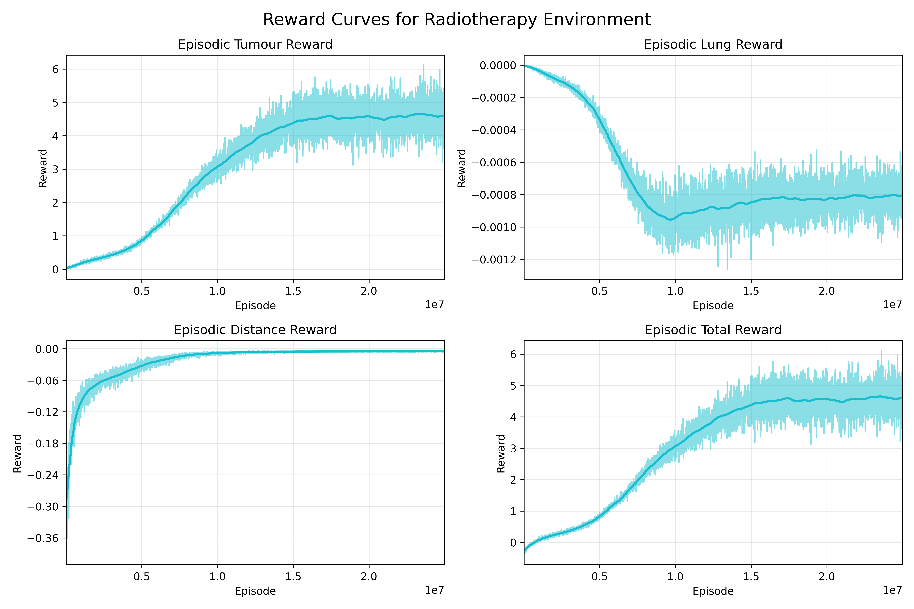

# Radiotherapy Simulated Environment for Reinforcement Learning

This project provides a simplified radiotherapy environment with 3D rendering which inherits the gymnasium class. It uses a modified implementation of Proximal Policy Optimization (PPO) for continuous actions, from [CleanRL](https://github.com/vwxyzjn/cleanrl). 




## Installation

1. Clone the repository:
    ```sh
    git clone https://github.com/rmaguado/ppo-radiotherapy.git
    cd ppo-radiotherapy
    ```

2. Set up the environment:
    ```sh
    conda env create -f environment.yml
    conda activate rl-radio
    ```

## Quickstart

### Training

To train the PPO model, first copy and rename the default config template file:

default.yaml.template -> default.yaml

Then, run the train.py script:

```sh
python train.py --config-file=configs/default.yaml --output-dir=runs/experiment1
```

A template script for running on a slurm cluster is provided in the sjob.sh and sjob.template scripts. 

### Evaluation

The training script will generate a tensorboard logfile with rewards and metrics, and save checkpoints of the model. 

You can generate visuals from these logs using the jupyer notebook found in notebooks/training-curve.ipynb



To create animations of the trained model like the one seen above, use the ppo_visualize.py script. 


## Using a 3D CNN

By default, the observation space is a summary of the 3d model by including coordinates and angle of the beam, as well as the tumour's coordinates. To use voxel data from the 3D models, set the config parameter `visionless` to false. This will also use the FeaturesExtractor3D class, which is a 3D CNN adapted from C3D architecture. Keep in mind that I've had no success training this model due to not having enough GPU memory to use large enough batches. 


## License

You may use the code from this repository for any purpose but please consider crediting me and the awknowledged sources.


## Acknowledgments

- The 3D CNN architecture is adapted from C3D: https://arxiv.org/pdf/1412.0767
- Proximal Policy Optimization (PPO) Paper: https://arxiv.org/pdf/1707.06347v2
- The PPO implementation is borrowed from CleanRL https://github.com/vwxyzjn/cleanrl

